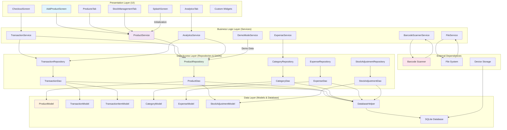

# System Architecture Diagram for Sarisari Store App

This diagram illustrates the layered architecture of the Sarisari Store Flutter application, showing the flow of data and responsibilities across different layers.

## Architecture Layers Explanation

### Presentation Layer
- **Screens**: AddProductScreen, ProductsTab, CheckoutScreen, AnalyticsTab, StockManagementTab, SplashScreen
- **Widgets**: Reusable UI components for product cards, search bars, charts, etc.
- **Responsibility**: User interaction, data display, navigation

### Business Logic Layer
- **Services**: ProductService, TransactionService, AnalyticsService, ExpenseService, BarcodeScannerService, FileService, DemoModeService
- **Responsibility**: Business rules validation, data processing, coordination between UI and data layers

### Data Access Layer
- **Repositories**: Abstract data operations, provide clean API for services
- **DAOs**: Direct database operations using SQL queries
- **Responsibility**: Data persistence, query optimization, abstraction of data sources

### Data Layer
- **Models**: Data structures representing business entities
- **DatabaseHelper**: SQLite database management, schema creation, migrations
- **SQLite Database**: Local data storage
- **Responsibility**: Data storage, retrieval, integrity

### External Dependencies
- **Barcode Scanner**: Hardware/camera integration for product scanning
- **File System**: Image storage, export functionality
- **Device Storage**: Persistent data storage

## Data Flow
1. User interacts with UI (Presentation Layer)
2. UI calls Services (Business Logic Layer) for operations
3. Services use Repositories (Data Access Layer) for data operations
4. Repositories delegate to DAOs for database interactions
5. DAOs work with Models and DatabaseHelper to persist/retrieve data
6. Results flow back up the layers to update the UI

This layered architecture ensures separation of concerns, testability, and maintainability.