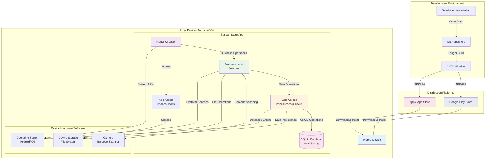

# Deployment Diagram for Sarisari Store App

This diagram shows the physical deployment of the Sarisari Store Flutter application components across different hardware nodes and environments.

## Deployment Components

### Development Environment
- **Developer Workstation**: Where the Flutter app is developed using Dart and Flutter SDK
- **Git Repository**: Version control for source code management
- **CI/CD Pipeline**: Automated building, testing, and deployment process

### Distribution Platforms
- **Google Play Store**: Distribution platform for Android APK files
- **Apple App Store**: Distribution platform for iOS IPA files

### User Device
The app runs entirely on the user's mobile device with no external server dependencies:

#### App Components
- **Flutter UI Layer**: User interface screens and widgets
- **Business Logic Services**: Product, Transaction, Analytics, and other services
- **Data Access Layer**: Repositories and DAOs for data operations
- **SQLite Database**: Local relational database for data persistence
- **App Assets**: Images, icons, and other static resources

#### Device Resources
- **Camera**: Used for barcode scanning functionality
- **Device Storage**: File system for database files and user data
- **Operating System**: Android or iOS providing platform APIs

## Deployment Flow
1. Developers write code on workstations and push to Git
2. CI/CD pipeline builds the app for both platforms
3. Built APKs/IPAs are uploaded to respective app stores
4. Users download and install the app on their devices
5. App runs locally with all data stored on device
6. App accesses device hardware (camera, storage) as needed

## Key Characteristics
- **Offline-First**: No internet connection required for core functionality
- **Local Storage**: All data persists locally on device
- **Cross-Platform**: Single codebase deployed to both Android and iOS
- **Self-Contained**: No external APIs or cloud services required